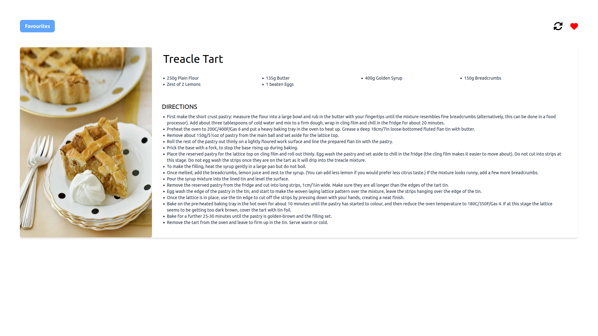
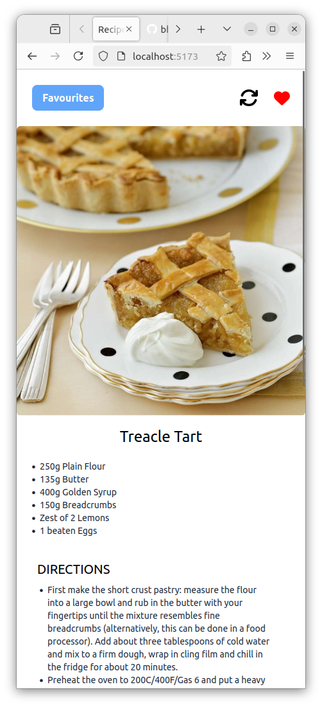

# Recipe App Generator

## Welcome! 👋

In this project, you'll learn how to interact with a 3rd party API, TheMealDB, to generate random recipes. Users will have the ability to generate random meals and save their favorites.

## Tasks

1. View optimal layout depending on user screen size.
2. Generate random meals.
3. Utilize localStorage to save meals to favorites.

## Tools

1. React JS
2. Tailwind CSS

## Resources

- React Icons [ReactIcons](https://react-icons.github.io/react-icons/)
- Meal API: [TheMealDB](https://www.themealdb.com/)

